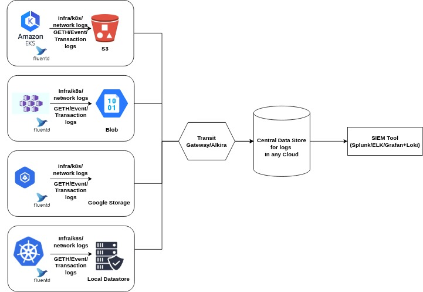

# Goquorum
This repository includes goquorum quicksetup on a single Node VM as well as on K8S. It also includes the interaction with the network using GETH. Post that it includes how to create a dAPP and deploy it in local network and how we can leverage on some devsecops toolchain for automated and secure deployment of dApp. At the end we will cover the production grade consideration for GoQuorum Network.

> Please Note that this repository code and script will include some manual inputs, so its not a fully automated system for the deployment. Please do look out for comment in the scripts since this repository is for demo purpose

# Table of contents
1. [Quorum Blockchain Network](#quorum-blockchain-network)
2. [GETH API and Blockchain Transaction Demonstration](#geth-api-and-blockchain-transaction-demonstration)
3. [dApp (UI and SmartContract) Development and Demo in Action](#dapp-ui-and-smartcontract-development-and-demo-in-action)
4. [DevSecOps](#devsecops)
5. [GoQuorum BlockChain network on Kubernetes Cluster](#goquorum-blockchain-network-on-kubernetes-cluster)
6. [Secure, Resilient & HA Infrastructure](#secure-resilient--ha-infrastructure)

## Quorum Blockchain Network

### Quorum
A soft fork of the public Ethereum Blockchain

Primary Features
- Privacy. Transactions and smart contracts on the blockchain can be private.
- Voting-based consensus mechanisms. Raft-based and Istanbul Byzantine Fault Tolerance (BFT) consensus mechanisms.
- Peer/node permissioning using smart contracts, which ensures that only known parties can join the network
- Increased scalability and network performance.

**Basic Architecture**

The system architecture of a basic quorum network looks somthing like this


where the role of each node is mentioned below:

1. **Boot Node**: Boot nodes serve as network entry points for new nodes joining the Quorum network. They maintain the list of active nodes in the network, providing information to new nodes about the existing network topology. Boot nodes facilitate the initial connection and discovery process for nodes joining the network.
2. **Voting Node**: Voting nodes participate in the consensus process by validating and confirming transactions. They play a crucial role in reaching an agreement on the state of the blockchain. In Quorum's consensus mechanism, such as QuorumChain.
3. **Constellation Node**: These nodes handle private transactions using the Constellation protocol. They are responsible for encrypting and decrypting private data exchanged between parties involved in private transactions. Constellation nodes ensure the confidentiality and privacy of sensitive information shared on the Quorum blockchain.
4. **Block Maker Node**: Block maker nodes are responsible for creating new blocks by packaging validated transactions. These nodes propose new blocks to be added to the blockchain. They collect transactions, form blocks, and broadcast them to other nodes for validation. 
5. **Transaction Node**: Transaction nodes process transactions by executing smart contracts and updating the blockchain's state. They participate in the validation of transactions and smart contract interactions across the network.
6. **Permissioning Node**: Permissioning nodes manage the access control and permissions within the Quorum network. They enforce rules related to node participation, privacy, and network access, ensuring that only authorized entities can join or perform specific actions on the blockchain.

When it comes to the deployment of GoQourum network, we generally have following nodes and each nodes aligns with the role that mentioned above. The following diagram depicting the components after deploying it in an environment.


This schematic representation illustrates the interaction between Validator, Member, and RPC nodes within the Quorum blockchain network.

1. **Validator Node**: Responsible for participating in the consensus mechanism and confirming transactions.
2. **Member Node**: Includes various types of nodes like **Constellation(Privacy Manager Tessera)**, Transaction, and other nodes performing different functions within the network.
3. **RPC Node**: Acts as an interface for external interaction, providing APIs for remote access to the Quorum blockchain network.

> Quorum Node: Allows voting based consensus mechanism instead of proof of work and allowing transaction and smart contract to be privately executed<br>
> Constellation: Implements the privacy feature of Quorum<br>
    1. A transaction manager stores and allows access to encrypted transaction data, exchanges encrypted payloads with other participants' transaction manager, but don't have access to any sensitive private key.<br> 
    2. Enclave works with the transaction manager to strengthen the privacy by managing encryption and decryption in an isolated way. The enclave stores private keys and is essentially a virtual HSM or hardware security module which is an encryption method 

**Quick Setup in an AWS EC2 instance** 

Quorum dev quickstart provides the steps to simply setup a 7 node blockchain network. This 7 node will be running as container in a single VM.<br>
I provisioned an EC2 instance of 8 core and 32 GB RAM(t2.2xlarge), ubuntu with 80GB storage. For testing purpose I have opened all the ports to my home IP.<br>

Take a look at the `quorum-dev-quickstart-steps.sh` file


**This setup will create following components:**
- Four IBFT validator nodes and a RPC node are created to simulate a base network.<br>
- In addition, there are three member pairs (GoQuorum and Tessera sets) to simulate private nodes on the network.<br>
- Apart from these, there are some explorer, logging and monitoring components like chainlens, Web Explorer, blockscout, Loki, Prometheus and Grafana.<br>

I installed cakeshop to interact with the quorum network via UI.<br>
The installation step is mentioned in `quorum-dev-quickstart-steps.sh` file.<br>

So the list of endpoint for this quickstart setup will be like following.

- JSON-RPC HTTP service endpoint                 : http://localhost:8545<br>
- JSON-RPC WebSocket service endpoint            : ws://localhost:8546<br>
- Web block explorer address                     : http://localhost:25000/explorer/nodes<br>
- Chainlens address                              : http://localhost:8081/<br>
- Blockscout address                             : http://localhost:26000/<br>
- Prometheus address                             : http://localhost:9090/graph<br>
- Grafana address                                : http://localhost:3000/d/a1lVy7ycin9Yv/goquorum-overview?orgId=1&refresh=10s&from=now-30m&to=now&var-system=All<br>
- Collated logs using Grafana and Loki           : http://localhost:3000/d/Ak6eXLsPxFemKYKEXfcH/quorum-logs-loki?orgId=1&var-app=quorum&var-search=<br>
- Cakeshop                                       : http://localhost:8999<br>


### Production Setup Consideration:

1. Infrastructure Layer:
    - Having Multiple Environments
    - Deploy it in Container Platform like Kubernetes
    - Better to deploy on Cloud for leveraging managed services
2. Quorum Layer:<br>
    a. Account/Key management: Better to use `account plugins` for key management which allows us to extend GoQuorum to manage keys with `hashicorp-vault`.<br>
    b. Transaction Management: By default the transaction manager is configured with HTTP. But for production its recommended to use `HTTP connection using TLS`. When it comes to gas, it is something that can be enabled or disabled based on business use cases.<br> 
    c. Smart Contract Management: Version the smart contract to a dedicated registry and keep track of the logs. <br>
    d. Consensus Management: Choose appropriate consensus protocol based on use cases, and make sure the number of nodes are available to achieve HA.<br>
    e. Monitoring and Logging: Enable appropriate monitoring on node health and transaction also enable logging and its management like archiving or analytics on logs.<br>
    f. Multitenancy: To achieve multitenancy, we need to configure authorization server like Okta.<br>
    g. Transaction Sentry: Enable `revert reason` in goquorum node so that EVM passes back to the client an optional string message containing information about the error.<br>
    h. Back and restore: Plan and test the back and restore on GoQuorum nodes.<br>

## GETH API and Blockchain Transaction Demonstration

There are steps at the end in `quorum-dev-quickstart-steps.sh` file, which will install `geth` cli in the same VM<br>

There are multiple ways to interact with BlockChain Network API, one is via `curl` and another is via `geth` js interactive.

**Inspecting nodes/peers information**

```
geth attach http://localhost:8545
eth.accounts
admin.nodeInfo
admin.peers
admin.peers.length
```

```
curl -X POST --data '{"jsonrpc":"2.0","method":"admin_nodeInfo","params":[],"id":1}' -H 'Content-Type: application/json' http://localhost:8545 | jq .
curl -X POST --data '{"jsonrpc":"2.0","method":"admin_peers","params":[],"id":1}' -H 'Content-Type: application/json' http://localhost:8545 | jq .
```

**Inspecting chain, block and transaction information**

```
eth.blockNumber
eth.getBlockByNumber(output of above).number
eth.getTransactionFromBlock(hex output from above)
```

```
curl -X POST --data '{"jsonrpc":"2.0","method":"eth_blockNumber","params":[],"id":1}' -H 'Content-Type: application/json' http://localhost:8545 | jq .
curl -X POST --data '{"jsonrpc":"2.0","method":"eth_getBlockByNumber","params":["hexresultfromabove", true],"id":1}' -H 'Content-Type: application/json' http://localhost:8545
curl -X POST --data '{"jsonrpc":"2.0","method":"eth_getTransactionByBlockNumberAndIndex","params":["<hexresult>", "<difficulty>"],"id":1}' -H 'Content-Type: application/json' http://localhost:8545
```

**Creating wallets / accounts and transferring Ether between accounts**

```
eth.accounts
###
Open another terminal and enter below command
geth account new
geth account list
###
eth.sendTransaction({
    from: eth.accounts[0],
    to: "0xaccountof new",
    value: web3.toWei(500.0, 'ether')
});
eth.getBalance('0xAccountnumber of new')
eth.getBalance(eth.acounts[0]);
```

```
curl -X POST --data '{"jsonrpc":"2.0","method":"eth_accounts","params":[],"id":1}' -H 'Content-Type: application/json' http://localhost:8545 | jq .
###
Open another terminal and enter below command
geth account new
geth account list
###
curl -X POST --data '{"jsonrpc":"2.0","method":"eth_sendTransaction","params":[{"from": "0xc9c913c8c3c1cd416d80a0abf475db2062f161f6","to":"newaccountnumber","gas": "0x76c0","gasPrice": "0x0", "value": "0x1", "data": ""}],"id":1}' -H 'Content-Type: application/json' http://localhost:8545
curl -X POST --data '{"jsonrpc":"2.0","method":"eth_getBalance","params":["0xc9c913c8c3c1cd416d80a0abf475db2062f161f6", "latest"],"id":1}' -H 'Content-Type: application/json' http://localhost:8545
```

## dApp (UI and SmartContract) Development and Demo in Action

This is a simple Hello World Application written in solidity and react. Please follow the instruction to setup and use the application. <br>


**Development Framework**
- Node.js 
- Truffle
- solidity
- Ether.js
- Ganache
- Metamask

**Ganache and Metamask Setup**

- Install Metamask in the browser <br>
- Start Ganache local test ethereum network and import the wallet in metamask by passing the mnemonic of ganache<br>
- Create a network in metamask wallet by entering the rpc url of ganache and chain id. And switch from ethereum main net to local ganache network.
We will be able to see the fake ethereum amount for testing our app

```
git clone https://github.com/nikitsrj/dApp-smartcontract.git
cd dApp-smartcontract-blockchain
truffle compile
truffle migrate
truffle test
cd frontend
npm install
npm start
```
Go to the browser and hit http://localhost:3000<br>

Enter the message in `Update Message` text box and click on `Update`<br>


Post that we will see Metamask popup and it will ask to confirm the transaction<br>
 

Once we will click on Confirm then the message will be updated in the site after the successfull transaction<br>


## DevSecOps

In this section we will see CI/CD stages along with security tools integrationat every stages.<br>

When it comes to a production grade cloudnative DevSecOps pipeline for microservice based application(web2.0) it typically looks like following <br>


The stack includes following tool chains.
- SCM: AWS CodeCommit
- Security Advisory for Scource Code Vulnerability(IDE Plugin): Snyk
- Pre-commit secret check: Talisman(Installed in developers laptop)/git-secrets(part of build stages)
- Build Tools: AWS CodeBuild, CodePipeline
- SCA and SAST: Anchore, SonarQube
- Docker image scanning: AWS ECR scanner
- Artifact or Registry: AWS ECR
- secret store: AWS Secrets
- DAST: OWASP ZAP
- Security Reports and Alerts management: Security Hub, AWS System Manager Ops center
- Chaos engineering: AWS Fault Injection Simulator
- Canary deployment: Flagger
- RASP: Falco
- AIOps: AWS DevOps guru

I have delivered this pipeline in my previous organizations.<br> 

**We can also use some of the above tools in web3.0 wherever applicable and add the below mentioned tools for web3.0 for secure Pipeline<br>**

Since the usecase here is for web3.0, this is an ideal DevSecOps pipeline would look like for me.


and for demo purpose and keeping startup contraints in mind the DevSecOps pipeline is something like this.


The stack includes following tool chains.
- SCM: GitHub
- Security Advisory for Scource Code Vulnerability(IDE Plugin): Snyk
- Pre-Commit: Talisman
- CI/CD Tool: GitHub Action
- Linting: Solhint
- SCA and SAST : Anchore and Slither
- Build and Test: Truffle and NPM

## GoQuorum BlockChain network on Kubernetes Cluster
- Used AWS EKS as Kubernetes Platform
- The best practice is to setup EKS with Private endpoint, but if I will use k8s cluster as private, I will have to setup the vpc endpoint for EC2, ECR and rest of another services.
- This might increase the time to setup, because I have to pull all the images of quorom components and push it to ECR and change the helm chart values.yaml file.
- The main reason for not going to fully private cluster is because of VPC endpoint which will increase the cost of resources :)
- But I did have set up a production grade K8S cluster in SGX and previous Organization.

**EKS cluster : DEMO**

## Secure, Resilient & HA Infrastructure

**Infrastructure Layer**

- To deploy a Quorum Blockchain network we can leverage on **Kubernetes** Platform. For a production grade K8s cluster, we have to consider the following points.
A private k8s cluster looks like below.


    - Network Layer:
        - Have a single public subnet and three private subnet to span across multi-AZ
        - Single Public Subnet is because of having Kubectl node, and public ELB
        - Spin up EKS Cluster with private endpoint, so that cluster is not accessible outside of VPC
        - Enable VPC endpoint so that Cluster can access and communicate with another AWS Services like ECR or CloudWatch
        - Enable VPC CNI so that Pods within EC2 instance get the IP address from the Subnet CIDR, and for automatic attachment of ENI incase a Single ENI is not enough
        - Enable/Write CNI Network Policy so that only necessary source and destination pod can talk to each other
        - Have Seperate Ingress Controller for Operational tool traffic like Prometheus, grafana, ELK stack and Transactions based traffic of quorum
    - Security:
        - Have a strict control over rules of Security Group and allow only necessary rules.
        - Make sure control the ELB security group rules via ingress controller service file, since it auto updates manual intervention
        - For Authentication and Authorization purpose we can leverage on OIDC and RBAC. For service account permission we can use IRSA
        - Enable the Open Policy Agent, and write corporate based rule, for e.g. if the pod doesn't have specific label then it shouldn't run.
        - Enable ECR scan for the container images, and setup the solution where if the image have high CVE then the cluster shouldn't run the deployment including that image
        - Run the security benchmark tool like kubescape to verify what are the loopholes need to be fixed like pod security contexts etc...
        - Enable WAF, and IDS infront of ELB for incoming request
    - Resiliency and Node Management:
        - Run the worker node via node group under Autoscaling group spanning across multiple AZ
        - Have add-ons like HPA and Cluster autoscaler, which will spin up worker node incase the pods are in pending state due to resource unavailability
        - Enable storage class with options like VolumeBinding, Volume expansions and Topology for dynamic volume creation and support Stateful sets
        - Based on Organizational Need, if the worker node is different than AL2 then make sure to have it patched on scheduled basis.
        - Design for failure: Perform Chaos engineering using Fault Injection simulator to gather metrics and improve the system in failure
    - Operational Efficiency:
        - Maintain the entire infrastructure as Code, we can leverage on Terraform and Ansible
        - To deploy any smart contract we can leverage on CI/CD pipeline
        - We can stop and enable kubectl jumphost only when needed, as it will still be in public subnet. By stopping it we can reduce the risk
    - Monitoring and Logging:
        - Install fluentd so that all the container logs can be passed to cloudwatch logs and from their we can even visualise in managed Opensearch service
        - Enable all the logs of control plan for troubleshooting and management purpose
        - Enable managed prometheus and grafana for metrics scrapping, monitoring and alerting purposes.
        - Enable retention period of logs.
        - If needed enable X-ray watch as well to see the communication between pods
    - DR/Backup and recover:
        - If needed, we can setup Blue-Green Kubernetes cluster, cause it may be required during EKS upgrade.
        - For backup and recovery we can leverage on velero.


**Quorum Layer**

    The following are some consideration to build a secure private blockchain that I can think of:
    - Make sure to have private keys to store at some vault or secret manager
    - For Access control pls enable permissioning
    - Make sure to orchestrate the new node in such a way that it has new private key and can be part of blockchain network. So it needs to be orchestrated along with cluster autoscaler user data
    - The Tessera node must be more than two to support HA

    **Security Checklist**
    - Consortium:
        - Use a BFT consensus protocol in case nodes are managed by non-trusted participants.
        - Make sure consortium members provide a reasonable network service-level agreement (SLA).
        - Make sure private and public data is stored in an appropriate geographical legislation area due to compliance purpose
    - Quorum Node: 
        - Harden the worker node OS according to best practices 
        - Not have direct access to the worker node
        - Make sure to enable RASP to detect any anomoly on the containers running on Node
        - Have a patch management cycle
        - Encrypt all communications to and from the JSON-RPC interface using TLS to prevent data leakage and man-in-the-middle attacks
        - Ensure accounts' private-key-encrypted passwords are never stored in the host in any form
    - Transaction manager:
        - Run Tessera in an independent network segment in production.
        - Use mTLS authentication with Tessera's dependencies.
        - Store encryption keys in secure environments and support key rotation and in different and isolated environment.
        - Upgrade Tessera frequently, and use an immutable strategy when upgrading.

## Infosec and Monitoring

### SIEM in blockchain




**This is a high level diagram for SIEM system for Hybrid Blockchain Network. Following are the consideration points while designing the SIEM system**
- All the kubernetes cluster whether its managed or in on-prem it will have fluentd installed, and enable the cluster logging for core kubernetes master plane logs. This way we will be able to gather the k8s nodes logs as well as blockchain pod logs
- The kubernetes node related logs should be directod in one folder while the blockchain event logs in another.
- All the different cloud object storage logs should be transferred to a central location which will be source of SIEM tool.
- When it comes to the central location storage, if its in cloud, then we should consider having multicloud connectivity like transit gateway.
- When it comes to SIEM tool, we can leverage on Splunk/ELK or Prometheus+Grafana which is opensource.

